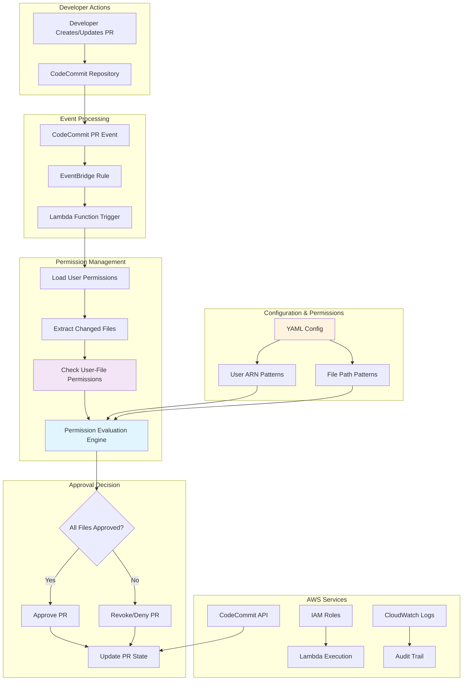
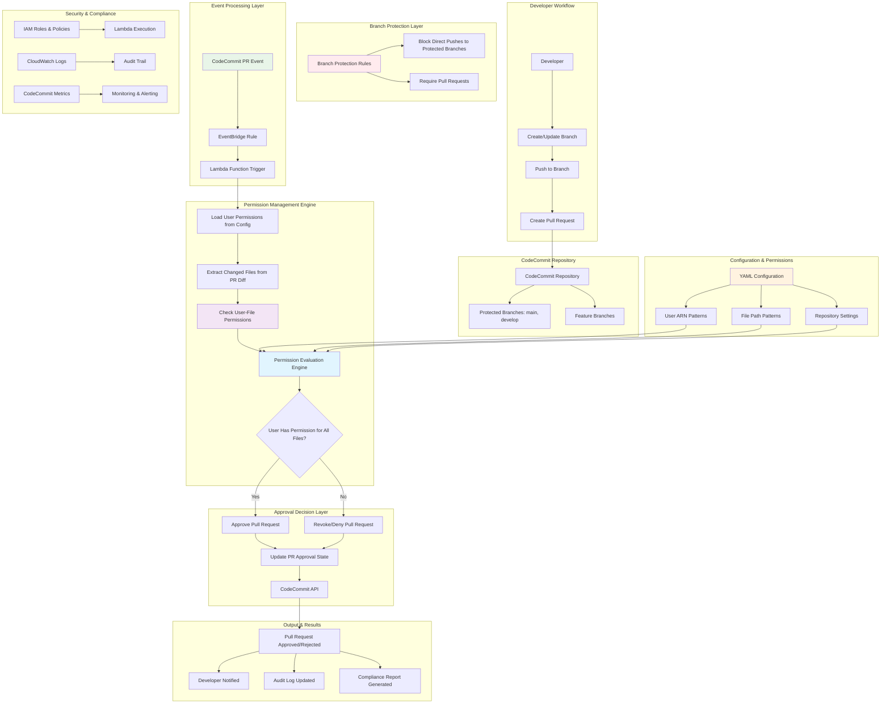
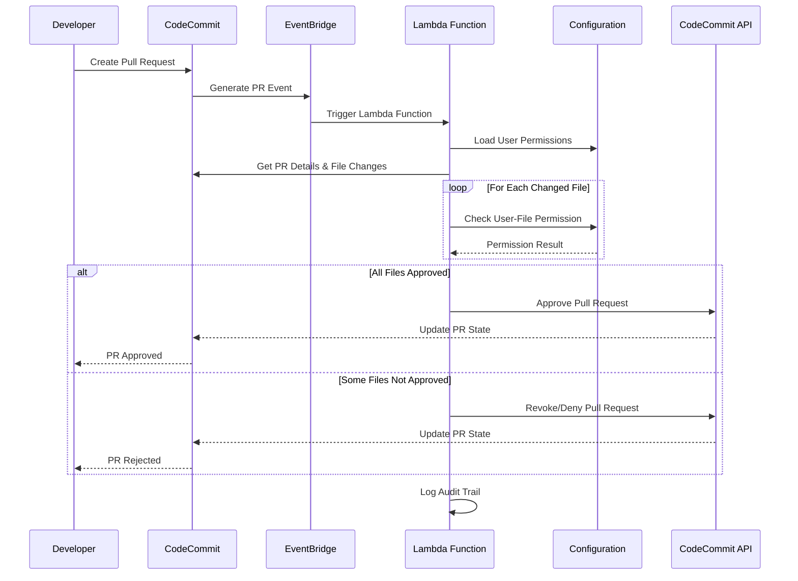
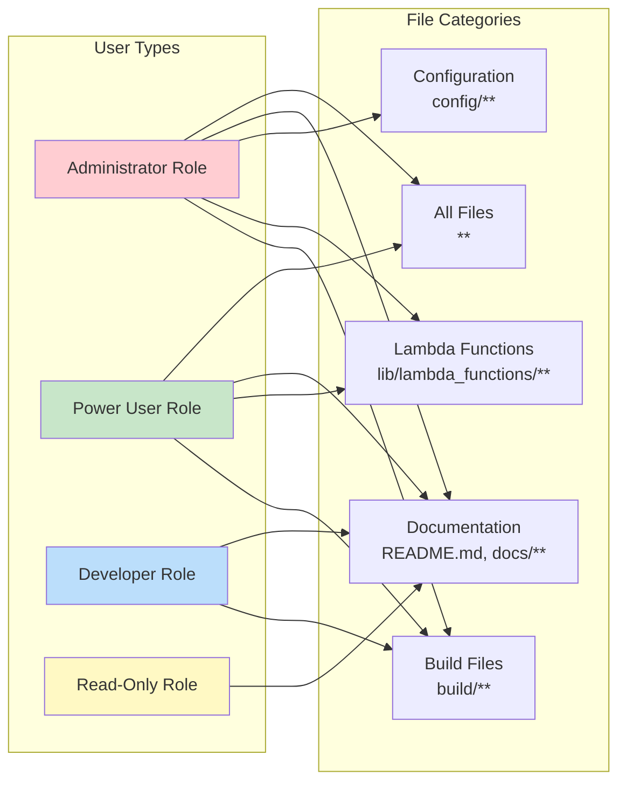

# PRApprovalStack Solution Design Document

## 1. Executive Summary

The PRApprovalStack is an automated pull request approval solution built on AWS CDK that provides intelligent, rule-based approval for CodeCommit pull requests. The solution automatically approves or revokes pull requests based on user permissions and file path patterns, ensuring compliance with organizational access control policies while reducing manual review overhead.

## 2. Problem Statement

### 2.1 Current Challenges
- **No Built-in File Permission Mechanism**: CodeCommit lacks a native file permission mechanism based on user identity - users can modify any file in any repository they have access to
- **Manual Pull Request Reviews**: Without automated file permission checking, all pull requests require manual review, which is time-consuming and resource-intensive
- **Inconsistent Approval Processes**: Different repositories and teams implement varying approval processes without standardized file-level access control
- **Difficulty in Enforcing File-Level Access Control**: Organizations struggle to implement granular access control policies (e.g., developers can only modify specific directories or file types)
- **Lack of Automated Compliance Checking**: No automated way to verify if users have permission to modify specific files in pull requests
- **Human Error in Review Process**: Manual reviewers may not know all file permission policies, leading to inconsistent approval decisions
- **Security Gaps**: Users with repository access can potentially modify files they shouldn't have access to, creating security vulnerabilities

### 2.2 Business Requirements
- **Implement File Permission Mechanism**: Create a file permission system based on user identity that CodeCommit lacks natively
- **Automate Pull Request Approval Process**: Automatically approve pull requests based on user permissions for specific files
- **Enforce File-Level Access Control Policies**: Implement granular access control at the file and directory level
- **Reduce Manual Review Overhead**: Eliminate manual reviews for changes that comply with permission policies
- **Maintain Audit Trail**: Provide comprehensive logging of all permission checks and approval decisions
- **Support Multiple Repositories and User Types**: Scale the permission system across different repositories and user roles
- **Ensure Security and Compliance Standards**: Meet organizational security requirements through automated permission enforcement
- **Bridge CodeCommit Limitations**: Provide functionality that CodeCommit doesn't offer out-of-the-box

## 3. Solution Overview

### 3.1 High-Level Architecture
The PRApprovalStack implements an event-driven, serverless architecture that automatically processes CodeCommit pull request events and applies approval rules based on configurable permissions. The solution manages permissions based on users to specific files, ensuring granular access control and automated compliance. **This addresses a fundamental limitation in CodeCommit, which lacks native file permission mechanisms based on user identity.**

```
CodeCommit PR Event → EventBridge → Lambda Function → Permission Check → Approval Decision → CodeCommit API
```

### 3.2 Solution Architecture Diagram



### 3.3 Key Components
- **PRApprovalStack**: Main CDK stack orchestrating all resources
- **GlobalLambdaFunctionConstruct**: Lambda function construct with execution environment
- **ApprovalRulesConstruct**: CodeCommit approval rule template management
- **PR Approval Lambda**: Core business logic for permission checking and approval decisions
- **Permission Management Engine**: User-to-file permission evaluation system

## 4. Detailed Architecture

### 4.1 Infrastructure Components

#### 4.1.1 PRApprovalStack
- **Purpose**: Main CDK stack that deploys all PR approval resources
- **Dependencies**: Requires configuration from pipeline configuration files
- **Resources**: Orchestrates Lambda function and approval rules deployment

#### 4.1.2 GlobalLambdaFunctionConstruct
- **Runtime**: Python 3.9
- **Handler**: `pr_approval_lambda.lambda_handler`
- **Timeout**: 30 seconds
- **Memory**: Default Lambda memory allocation
- **Environment Variables**:
  - `PIPELINE_NAME`: Name of the pipeline from configuration
  - `REPOSITORY_NAME`: Wildcard (*) for all repositories
  - `BRANCH_NAME`: Wildcard (*) for all branches
  - `PERMISSIONS_CONFIG`: JSON-encoded permissions configuration

#### 4.1.3 ApprovalRulesConstruct
- **Approval Rule Template**: Configurable approval rules using CloudComponents CDK package
- **Repository Association**: Links approval rules to specific CodeCommit repositories
- **Approval Requirements**: Configurable number of approvals needed (default: 1)

### 4.2 Event Flow Architecture

```
1. Developer creates/updates PR in CodeCommit
2. CodeCommit generates PR state change event
3. EventBridge rule captures event and triggers Lambda
4. Lambda function processes PR and checks permissions
5. Lambda makes approval decision based on file changes
6. Lambda updates PR approval state via CodeCommit API
7. CodeCommit applies approval rule and updates PR status
```

### 4.3 Permission Model

The solution implements a sophisticated **user-to-specific-files permission management system** that provides granular access control based on individual user identities and the specific files they attempt to modify. **This addresses a critical gap in CodeCommit, which has no built-in mechanism to restrict users to specific files or directories based on their identity.** **Important**: The permission sets are designed to block users from pushing directly to protected branches, while allowing pull requests to be automatically approved based on file-based approval templates when the user has appropriate permissions.

#### 4.3.1 Permission Structure
```yaml
permissions:
  - arn: "arn:aws:sts::*:assumed-role/AWSReservedSSO_AWSAdministratorAccess_*/*"
    paths:
      - "build/**"
  - arn: "arn:aws:sts::*:assumed-role/AWSReservedSSO_AWSPowerUserAccess_*/*"
    paths:
      - "build/**"
      - "README.md"
      - "lib/lambda_functions/**"
      - "**"
```

#### 4.3.2 Permission Evaluation Logic
- **User Pattern Matching**: Uses regex patterns to match user ARNs with high precision
- **File Path Matching**: Supports glob patterns (*, **) for flexible file path matching
- **User-File Association**: Direct mapping between specific users and specific file paths
- **Hierarchical Access**: More specific paths can override broader permissions
- **Wildcard Support**: ** pattern matches any directory depth
- **Granular Control**: Each user can have different permissions for different file sets

#### 4.3.3 User-to-File Permission Management
The system manages permissions based on **users to specific files** through:

1. **User Identification**: Captures the exact user ARN from the pull request event
2. **File Analysis**: Extracts all changed files from the pull request diff
3. **Permission Lookup**: Matches user ARN against permission patterns
4. **File Validation**: Checks if the user has permission to modify each specific file
5. **Decision Logic**: Approves only if user has permission for ALL changed files
6. **Audit Trail**: Logs which user attempted to modify which specific files

#### 4.3.4 Branch Protection and Pull Request Workflow
The permission system works in conjunction with branch protection rules:

- **Direct Push Prevention**: Users are blocked from pushing directly to protected branches (main, develop, etc.)
- **Pull Request Requirement**: All changes must go through pull requests
- **File-Based Approval**: Pull requests are automatically approved based on file-based permission templates
- **Approval Rule Templates**: CodeCommit approval rules ensure the automated approval process is enforced
- **Security Enhancement**: This two-layer approach (branch protection + automated PR approval) provides robust security
- **CodeCommit Gap Filling**: Provides file-level permission control that CodeCommit doesn't offer natively

## 5. Implementation Details

### 5.1 Lambda Function Logic

#### 5.1.1 Main Handler Flow
1. **Event Parsing**: Extract PR details from EventBridge event
2. **PR Retrieval**: Fetch complete PR information from CodeCommit
3. **File Difference Analysis**: Determine which files were changed
4. **Permission Checking**: Evaluate user permissions for each changed file
5. **Approval Decision**: Approve or revoke based on permission results
6. **State Update**: Update PR approval state via CodeCommit API

#### 5.1.2 Permission Checking Algorithm
```python
def check_user_permission(user_arn, file_path):
    """
    Check if a specific user has permission to modify a specific file.
    This function implements the core user-to-file permission management logic.
    """
    for permission in PERMISSIONS:
        if re.match(permission['user_pattern'], user_arn):
            for file_pattern in permission['file_patterns']:
                if re.match(file_pattern, file_path):
                    return True
    return False
```

### 5.2 Event Processing

#### 5.2.1 Supported Events
- `pullRequestCreated`: New pull request creation
- `pullRequestSourceBranchUpdated`: Source branch updates in existing PRs

#### 5.2.2 Event Filtering
- **Source**: `aws.codecommit`
- **Detail Type**: `CodeCommit Pull Request State Change`
- **Event Types**: Configurable via EventBridge rule

#### 5.2.3 User-File Permission Processing
The event processing system specifically handles **user-to-file permission management**:

1. **User Extraction**: Identifies the exact user ARN from the pull request event
2. **File Change Detection**: Analyzes the PR diff to identify all modified files
3. **Permission Validation**: For each changed file, validates if the user has permission
4. **Comprehensive Check**: Ensures the user has permission to modify ALL files in the PR
5. **Decision Execution**: Approves or revokes based on complete permission validation

#### 5.2.4 Pull Request vs Direct Push Handling
The system is specifically designed to work with pull requests, not direct pushes:

- **Pull Request Events Only**: Only processes pull request creation and update events
- **No Direct Push Support**: Direct pushes to branches are not processed by this system
- **Branch Protection Integration**: Works alongside branch protection rules that block direct pushes
- **Approval Template Enforcement**: Pull requests are automatically approved based on file-based permission templates
- **Workflow Enforcement**: Ensures all changes follow the proper pull request workflow

### 5.3 Security Considerations

#### 5.3.1 IAM Permissions
- **Lambda Execution Role**: Basic Lambda execution permissions
- **CodeCommit Access**: Limited to PR operations (get, update, approve)
- **Resource Scope**: Repository-specific permissions where possible

#### 5.3.2 Data Protection
- No sensitive data logging
- Environment variable encryption via Lambda
- Minimal required permissions principle

## 6. Configuration Management

### 6.1 Configuration Structure
The solution uses YAML-based configuration files that define:
- Pipeline and stack naming
- Account and region information
- Repository and branch specifications
- User permission mappings for file-based access control
- Build and deployment settings
- **Branch protection rules** (configured separately in CodeCommit)
- **Approval rule templates** for automated PR approval

### 6.2 Environment Variables
- **CDK_DEFAULT_ACCOUNT**: AWS account ID for deployment
- **Configuration Files**: YAML files in `config/` directory
- **Pipeline Name**: Context-based application naming

## 7. Deployment and Operations

### 7.1 CDK Deployment
```bash
# Deploy the entire solution
cdk deploy --all

# Deploy only PR approval stack
cdk deploy PRApprovalStack
```

### 7.2 Resource Naming Convention
- **Lambda Function**: `{pipeline-name}-pr-approval-function`
- **IAM Role**: `{pipeline-name}-pr-approval-lambda-role`
- **Event Rule**: `pipe-of-pipes-pr-approval-event-rule`
- **Approval Rule**: `{pipeline-name}-pr-approval`

### 7.3 Monitoring and Logging
- **CloudWatch Logs**: Lambda function execution logs
- **EventBridge Metrics**: Rule invocation and target delivery metrics
- **CodeCommit Metrics**: PR approval and rejection statistics

## 8. Testing and Validation

### 8.1 Test Scenarios
1. **Valid Permission**: User with appropriate permissions creates PR for allowed files
2. **Invalid Permission**: User without permissions creates PR for restricted files
3. **Mixed Permissions**: PR with files requiring different permission levels (user has access to some but not all)
4. **User-Specific File Access**: Different users with different file permissions
5. **File Path Pattern Matching**: Testing various glob patterns (*, **) and regex matching
6. **Edge Cases**: Empty PRs, deleted files, renamed files, nested directory structures
7. **Branch Protection Integration**: Verify that direct pushes to protected branches are blocked
8. **Pull Request Workflow**: Ensure all changes go through pull request approval process
9. **Approval Template Enforcement**: Validate that file-based approval templates are correctly applied

### 8.2 Validation Criteria
- Correct approval/revocation decisions based on user-file permissions
- Proper permission evaluation for each specific file in the PR
- Accurate user ARN pattern matching and file path validation
- Event processing accuracy with complete user and file information
- Error handling and logging for permission validation failures
- User-to-file permission mapping accuracy and consistency
- **Branch protection enforcement**: Direct pushes to protected branches are properly blocked
- **Pull request workflow compliance**: All changes follow the required pull request process
- **Approval template application**: File-based approval rules are correctly enforced

## 9. Solution Diagram

### 9.1 Complete Solution Architecture



### 9.2 Permission Flow Diagram



### 9.3 User Permission Matrix



## 10. Cost Analysis

### 10.1 Resource Costs
- **Lambda Function**: Pay-per-request pricing (~$0.20 per 1M requests)
- **EventBridge**: $1.00 per million events
- **CodeCommit**: Standard pricing for repository operations
- **IAM**: No additional cost

### 10.2 Cost Optimization
- **Event Filtering**: Minimize unnecessary Lambda invocations
- **Lambda Optimization**: Efficient code execution and timeout settings
- **Resource Cleanup**: Proper CDK resource lifecycle management

## 11. Security and Compliance

### 11.1 Security Features
- **Principle of Least Privilege**: Minimal required IAM permissions
- **Resource Isolation**: Repository-specific access controls
- **Audit Logging**: Comprehensive CloudWatch logging
- **Encryption**: Data encryption in transit and at rest

### 11.2 Compliance Considerations
- **Access Control**: Automated enforcement of file-level permissions
- **Audit Trail**: Complete record of approval decisions
- **Policy Enforcement**: Consistent application of security policies
- **Change Management**: Controlled PR approval process
- **Workflow Compliance**: Enforcement of pull request workflow requirements
- **Branch Protection**: Prevention of unauthorized direct pushes to protected branches
- **Approval Template Compliance**: Consistent application of file-based approval rules

## 12. Conclusion

The PRApprovalStack provides a robust, automated solution for pull request approval that significantly reduces manual review overhead while maintaining security and compliance standards. The solution's core strength lies in its **user-to-specific-files permission management system**, which provides granular access control based on individual user identities and the specific files they attempt to modify.

**Key Security Features:**
- **Branch Protection Integration**: Works alongside branch protection rules to block direct pushes to protected branches
- **Pull Request Workflow Enforcement**: Ensures all changes go through the proper pull request approval process
- **File-Based Approval Templates**: Automatically approves pull requests based on user permissions for specific files
- **Two-Layer Security**: Combines branch protection with automated PR approval for robust security
- **CodeCommit Gap Solution**: Addresses the fundamental limitation in CodeCommit's lack of native file permission mechanisms

The event-driven architecture ensures scalability and reliability, while the configurable permission system allows for flexible access control policies that can be tailored to organizational security requirements.

The solution successfully addresses the identified challenges by:
- **Implementing File Permission Mechanism**: Creating a file permission system that CodeCommit lacks natively
- Automating routine approval decisions based on user-file permissions
- Enforcing consistent access control policies at the file level
- Providing comprehensive audit trails of user actions and file modifications
- Supporting multiple repositories and user types with different permission sets
- Maintaining security and compliance standards through automated permission validation
- Implementing granular user-to-file access control for enhanced security
- **Enforcing pull request workflow**: Blocking direct pushes while enabling automated PR approval
- **Bridging CodeCommit Limitations**: Providing functionality that CodeCommit doesn't offer out-of-the-box

This design document serves as a comprehensive guide for understanding, implementing, and maintaining the PRApprovalStack solution, with particular emphasis on its sophisticated permission management capabilities, integration with branch protection systems, and its role in addressing CodeCommit's native limitations.
